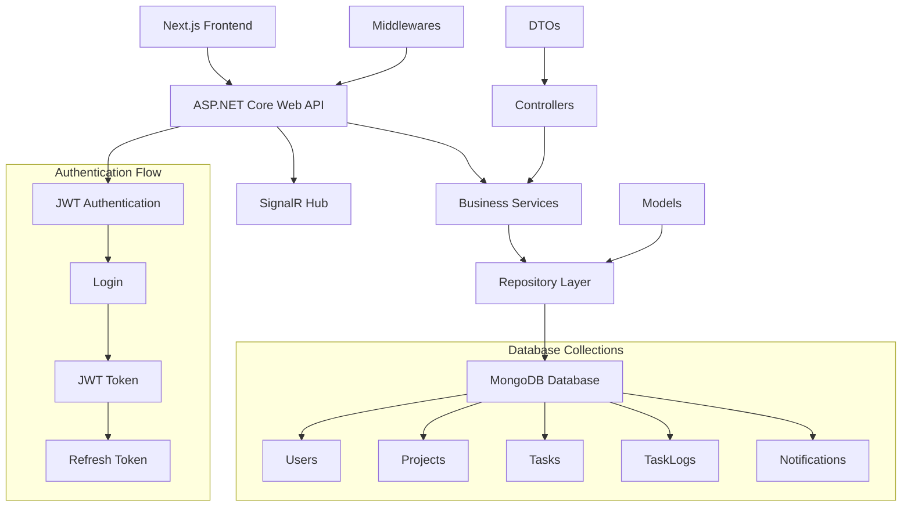

# Task Management System - Backend API

Enterprise-level task management system backend built with .NET 8 Web API, featuring JWT authentication, real-time notifications with SignalR, and MongoDB integration with comprehensive role-based access control.

## 🚀 Live Demo

**Deploy Link:** *Coming Soon - Will be deployed on Railway/Render/Fly.io*

## 🛠️ Technologies Used

### Core Technologies
- **.NET 8** - Latest .NET framework with Web API
- **C#** - Primary programming language
- **ASP.NET Core** - Web framework for building APIs
- **MongoDB** - NoSQL document database
- **MongoDB.Driver** - Official MongoDB .NET driver

### Authentication & Security
- **JWT Bearer Authentication** - Secure token-based authentication
- **BCrypt.Net** - Password hashing and security
- **System.IdentityModel.Tokens.Jwt** - JWT token handling
- **Role-based Authorization** - Admin, Manager, Developer roles

### Real-time & Communication
- **SignalR** - Real-time web functionality
- **CORS** - Cross-Origin Resource Sharing support
- **Swagger/OpenAPI** - API documentation

### Validation & Testing
- **FluentValidation** - Input validation framework
- **XUnit** - Unit testing framework
- **Moq** - Mocking framework for testing

## 🏗️ Architecture & Project Structure

### Layered Architecture Pattern
```
TaskManagement.API/
├── Controllers/           # API Controllers (Presentation Layer)
│   ├── AuthController.cs     # Authentication endpoints
│   ├── ProjectsController.cs # Project management endpoints
│   ├── TasksController.cs    # Task management endpoints
│   └── UsersController.cs    # User management endpoints
├── Services/             # Business Logic Layer
│   ├── Interfaces/          # Service interfaces
│   ├── AuthService.cs       # Authentication business logic
│   ├── ProjectService.cs    # Project management logic
│   ├── TaskService.cs       # Task management logic
│   ├── UserService.cs       # User management logic
│   ├── NotificationService.cs # Notification logic
│   └── JwtTokenService.cs   # JWT token management
├── Repositories/         # Data Access Layer
│   ├── Interfaces/          # Repository interfaces
│   ├── UserRepository.cs    # User data operations
│   ├── ProjectRepository.cs # Project data operations
│   ├── TaskRepository.cs    # Task data operations
│   ├── TaskLogRepository.cs # Task logging operations
│   └── NotificationRepository.cs # Notification operations
├── Models/               # Domain Models
│   ├── User.cs             # User entity
│   ├── Project.cs          # Project entity
│   ├── Task.cs             # Task entity
│   ├── TaskLog.cs          # Task log entity
│   └── Notification.cs     # Notification entity
├── DTOs/                 # Data Transfer Objects
│   ├── Auth/               # Authentication DTOs
│   ├── Project/            # Project DTOs
│   ├── Task/               # Task DTOs
│   └── User/               # User DTOs
├── Configurations/       # Configuration Classes
│   ├── MongoDbSettings.cs  # MongoDB configuration
│   └── JwtSettings.cs      # JWT configuration
├── Middlewares/          # Custom Middlewares
│   ├── ErrorHandlingMiddleware.cs # Global error handling
│   ├── JwtMiddleware.cs    # JWT token validation
│   └── LoggingMiddleware.cs # Request/response logging
├── Helpers/              # Utility Classes
│   ├── PasswordHelper.cs   # Password hashing utilities
│   ├── JwtHelper.cs        # JWT token utilities
│   ├── ValidationHelper.cs # Validation utilities
│   └── DateTimeHelper.cs   # Date/time utilities
├── Hubs/                 # SignalR Hubs
│   └── NotificationHub.cs  # Real-time notifications
└── Program.cs            # Application entry point

TaskManagement.Tests/     # Test Project
├── Controllers/          # Controller tests
├── Services/             # Service tests
├── Repositories/         # Repository tests
└── Helpers/              # Helper tests
```

### Database Collections (MongoDB)
```
TaskManagementDB/
├── Users                 # User accounts and profiles
├── Projects              # Project information and settings
├── Tasks                 # Task details and assignments
├── TaskLogs              # Task activity and change logs
└── Notifications         # User notifications and alerts
```

## ✨ Extra Features

### 🔐 Authentication & Authorization
- **JWT Token Management** - Access and refresh token system
- **Role-based Access Control** - Three-tier role system (Admin, Manager, Developer)
- **Password Security** - BCrypt hashing with salt rounds
- **Token Refresh** - Automatic token renewal mechanism
- **Protected Endpoints** - Route-level authorization

### 🔄 Real-time Features
- **SignalR Hub Integration** - Real-time notifications and updates
- **Live Task Updates** - Instant task status changes across clients
- **Real-time Notifications** - Push notifications for task assignments
- **Live Project Updates** - Real-time project member activities
- **Connection Management** - User presence and connection tracking

### 📊 Advanced Task Management
- **Comprehensive Task Logging** - Detailed activity tracking for all task changes
- **Priority Management** - Four-level priority system (Low, Medium, High, Critical)
- **Status Workflow** - Complete task lifecycle (ToDo → InProgress → Done/Cancelled)
- **Assignment System** - Multi-user task assignment with notifications
- **Due Date Management** - Task deadline tracking with overdue detection
- **Comment System** - Task-level commenting and collaboration

### 🗃️ Database Features
- **MongoDB Integration** - NoSQL document-based storage
- **Flexible Schema** - Dynamic document structure for scalability
- **Indexing Strategy** - Optimized queries with proper indexing
- **Data Validation** - Schema validation at database level
- **Aggregation Pipeline** - Complex queries and data analysis

### 🧪 Testing & Quality
- **Unit Testing** - Comprehensive XUnit test coverage
- **Integration Testing** - API endpoint testing
- **Mocking Framework** - Moq for dependency isolation
- **Test Data Management** - In-memory database for testing
- **Code Coverage** - Detailed coverage reports

### 📝 Logging & Monitoring
- **Structured Logging** - Comprehensive request/response logging
- **Error Handling** - Global exception handling middleware
- **Performance Monitoring** - Request timing and performance metrics
- **Audit Trail** - Complete user action tracking
- **Health Checks** - API and database health monitoring

### 🔧 API Features
- **RESTful Design** - Standard HTTP methods and status codes
- **Swagger Documentation** - Interactive API documentation
- **CORS Support** - Cross-origin request handling
- **Input Validation** - FluentValidation for request validation
- **Response Formatting** - Consistent API response structure

## 🏛️ System Architecture



## 🗄️ Database Setup & Configuration

### Prerequisites
- MongoDB 6.0+ installed locally or MongoDB Atlas account
- .NET 8 SDK
- Visual Studio 2022 or VS Code

### MongoDB Installation (Local)

#### Windows:
1. **Download MongoDB Community Server**
   ```
   https://www.mongodb.com/try/download/community
   ```

2. **Install MongoDB**
   - Run the installer
   - Choose "Complete" installation
   - Install as Windows Service
   - Install MongoDB Compass (GUI tool)

3. **Start MongoDB Service**
   ```bash
   net start MongoDB
   ```

4. **Verify Installation**
   ```bash
   mongosh
   ```

#### Using MongoDB Atlas (Cloud):
1. Create account at https://www.mongodb.com/atlas
2. Create a new cluster
3. Get connection string
4. Update `appsettings.json` with Atlas connection string

### Database Configuration

1. **Update Connection String**
   ```json
   {
     "ConnectionStrings": {
       "MongoDB": "mongodb://localhost:27017"
     },
     "MongoDB": {
       "DatabaseName": "TaskManagementDB",
       "ConnectionString": "mongodb://localhost:27017"
     }
   }
   ```

2. **For MongoDB Atlas:**
   ```json
   {
     "ConnectionStrings": {
       "MongoDB": "mongodb+srv://<username>:<password>@<cluster>.mongodb.net/<database>"
     },
     "MongoDB": {
       "DatabaseName": "TaskManagementDB",
       "ConnectionString": "mongodb+srv://<username>:<password>@<cluster>.mongodb.net/<database>"
     }
   }
   ```

### Database Initialization

The application will automatically create the database and collections on first run. The following collections will be created:

- **Users** - User accounts with roles and authentication data
- **Projects** - Project information with team members
- **Tasks** - Task details with assignments and status
- **TaskLogs** - Audit trail for all task changes
- **Notifications** - User notifications and alerts

### Sample Data Creation

On first run, the application will create:
- Default admin user (admin@taskmanagement.com / Admin123!)
- Sample projects and tasks for demonstration
- Initial notification templates

## 🚦 Getting Started

### Installation Steps

1. **Clone the repository**
   ```bash
   git clone <repository-url>
   cd backend/TaskManagement.API
   ```

2. **Install .NET 8 SDK**
   ```bash
   # Verify installation
   dotnet --version
   ```

3. **Restore NuGet packages**
   ```bash
   dotnet restore
   ```

4. **Configure Database**
   - Install MongoDB locally or setup MongoDB Atlas
   - Update `appsettings.json` with your connection string

5. **Update JWT Settings**
   ```json
   {
     "JwtSettings": {
       "SecretKey": "your-super-secret-key-that-is-at-least-32-characters-long-for-security",
       "Issuer": "TaskManagement.API",
       "Audience": "TaskManagement.Client",
       "ExpiryInMinutes": 60,
       "RefreshTokenExpiryInDays": 7
     }
   }
   ```

6. **Configure CORS for Frontend**
   ```json
   {
     "Cors": {
       "AllowedOrigins": [
         "http://localhost:3000",
         "https://localhost:3001",
         "https://your-frontend-domain.com"
       ]
     }
   }
   ```

7. **Run the application**
   ```bash
   dotnet run
   ```

8. **Access Swagger Documentation**
   ```
   https://localhost:5001/swagger
   ```

### Development Commands

```bash
# Run in development mode
dotnet run

# Run with hot reload
dotnet watch run

# Build the project
dotnet build

# Run tests
dotnet test

# Publish for production
dotnet publish -c Release
```

### Environment Variables

⚠️ **SECURITY WARNING**: Never commit real credentials to version control!

Create `appsettings.Development.json` for local development:

```json
{
  "ConnectionStrings": {
    "MongoDB": "mongodb://localhost:27017"
  },
  "JwtSettings": {
    "SecretKey": "your-development-secret-key-here"
  },
  "Logging": {
    "LogLevel": {
      "Default": "Debug",
      "Microsoft.AspNetCore": "Information"
    }
  }
}
```

**For Production**: Use environment variables or secure configuration management:
```bash
# Set environment variables
export ConnectionStrings__MongoDB="your-production-mongodb-connection"
export JwtSettings__SecretKey="your-production-secret-key"
```

## 📋 API Endpoints

### Authentication
- `POST /api/auth/login` - User login
- `POST /api/auth/register` - User registration
- `POST /api/auth/refresh` - Refresh JWT token
- `POST /api/auth/logout` - User logout

### Users
- `GET /api/users` - Get all users (Admin only)
- `GET /api/users/{id}` - Get user by ID
- `PUT /api/users/{id}` - Update user
- `DELETE /api/users/{id}` - Delete user (Admin only)

### Projects
- `GET /api/projects` - Get user projects
- `POST /api/projects` - Create new project
- `GET /api/projects/{id}` - Get project details
- `PUT /api/projects/{id}` - Update project
- `DELETE /api/projects/{id}` - Delete project

### Tasks
- `GET /api/tasks` - Get user tasks
- `POST /api/tasks` - Create new task
- `GET /api/tasks/{id}` - Get task details
- `PUT /api/tasks/{id}` - Update task
- `DELETE /api/tasks/{id}` - Delete task
- `POST /api/tasks/{id}/comments` - Add task comment

## 🧪 Testing

### Running Tests
```bash
# Run all tests
dotnet test

# Run tests with coverage
dotnet test --collect:"XPlat Code Coverage"

# Run specific test project
dotnet test TaskManagement.Tests
```

### Test Structure
- **Unit Tests** - Service and repository layer testing
- **Integration Tests** - API endpoint testing
- **Mock Data** - Realistic test data generation

## 🚀 Deployment

### Production Configuration

1. **Update Production Settings**
   ```json
   {
     "ConnectionStrings": {
       "MongoDB": "your-production-mongodb-connection-string"
     },
     "JwtSettings": {
       "SecretKey": "your-production-secret-key"
     }
   }
   ```

2. **Build for Production**
   ```bash
   dotnet publish -c Release -o ./publish
   ```

3. **Deploy Options**
   - **Railway**: Connect GitHub repository
   - **Render**: Web service deployment
   - **Fly.io**: Container deployment
   - **Azure App Service**: Microsoft cloud platform
   - **AWS Elastic Beanstalk**: Amazon cloud platform

### Docker Support (Optional)

```dockerfile
FROM mcr.microsoft.com/dotnet/aspnet:8.0 AS base
WORKDIR /app
EXPOSE 80
EXPOSE 443

FROM mcr.microsoft.com/dotnet/sdk:8.0 AS build
WORKDIR /src
COPY ["TaskManagement.API.csproj", "."]
RUN dotnet restore
COPY . .
RUN dotnet build -c Release -o /app/build

FROM build AS publish
RUN dotnet publish -c Release -o /app/publish

FROM base AS final
WORKDIR /app
COPY --from=publish /app/publish .
ENTRYPOINT ["dotnet", "TaskManagement.API.dll"]
```

## 🔧 Configuration

### JWT Configuration
- **SecretKey**: Minimum 32 characters for security
- **ExpiryInMinutes**: Token lifetime (default: 60 minutes)
- **RefreshTokenExpiryInDays**: Refresh token lifetime (default: 7 days)

### MongoDB Configuration
- **ConnectionString**: MongoDB connection URL (use environment variables for production)
- **Security Note**: Never commit real credentials to version control
- **DatabaseName**: Database name (default: TaskManagementDB)

### SignalR Configuration
- **HubUrl**: SignalR hub endpoint (default: /notificationHub)

## 🤝 Contributing

1. Fork the repository
2. Create your feature branch (`git checkout -b feature/AmazingFeature`)
3. Commit your changes (`git commit -m 'Add some AmazingFeature'`)
4. Push to the branch (`git push origin feature/AmazingFeature`)
5. Open a Pull Request

## 📝 License

This project is licensed under the MIT License - see the [LICENSE](LICENSE) file for details.

## 👨‍💻 Author

**Ahmet C Development**
- GitHub: [@ahmetcdevelopment](https://github.com/ahmetcdevelopment)

---

⭐ **Star this repository if you find it helpful!**
